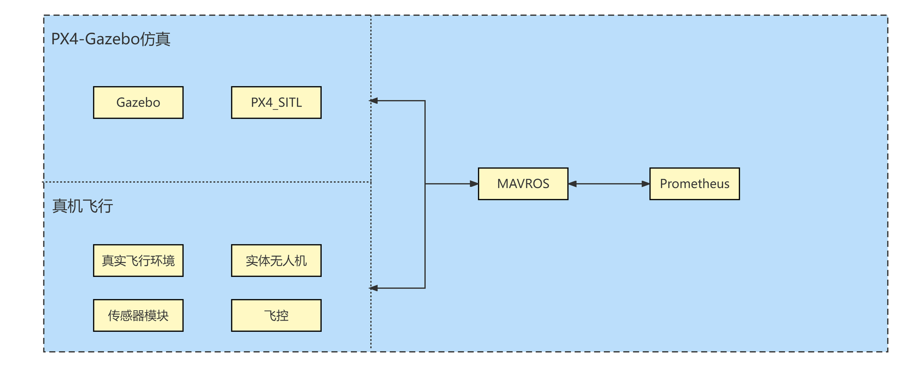

# EasonDrone_Gazebo

The easondrone_gazebo package.





## Compilation

```shell
cd ~/EasonDrone
catkin_make install --source Simulator/EasonDrone_Gazebo --build Simulator/EasonDrone_Gazebo/build
```


## Launch

For p450:

```shell
roslaunch easondrone_gazebo simu_p450.launch
```

For iris:

```shell
roslaunch easondrone_gazebo simu_iris.launch
```


## Acknowledgement

Thanks to following packages:

- [prometheus_gazebo](https://github.com/amov-lab/Prometheus/Simulator/gazebo_simulator)
- [sitl_gazebo](https://github.com/PX4/sitl_gazebo)
